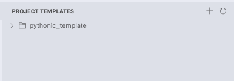

# Project Template Manager

## Overview

Project Template Manager streamlines your development workflow by allowing you to create, manage, and reuse project templates directly within VS Code. Say goodbye to repetitive setup and hello to consistent, professional project structures. Whether you're scaffolding a new application or adding components to an existing one, this extension saves you time and effort.

*Note: The screenshot above may not reflect the latest UI updates.*

## Key Features

- **Dedicated Template Explorer**: Access all your project templates from a dedicated view in the VS Code sidebar for easy navigation.
- **Live File Previews**: Click on any file within a template to view its content in a preview tab before deciding to use it. No need to copy first!
- **Flexible File Copying**: When adding a template file or folder, intelligently choose your destination. Copy to the directory of your currently open file, or browse to any folder in your workspace.
- **Full Project Scaffolding**: Generate a complete, ready-to-code project structure from a template with a single command.
- **Cherry-Pick Components**: Selectively add individual files or entire folders from a template into your existing workspace.
- **Easy Template Management**: Effortlessly add new templates from your existing projects or remove templates you no longer need.

## Usage Walkthrough

### 1. Exploring Your Templates
- Open the **Template Explorer** by clicking the Project Templates icon in the Activity Bar.
- Here, you'll see a list of all your available templates. You can expand each template to view its file and folder structure.

### 2. Previewing Template Files
- In the Template Explorer, simply click on any file.
- A read-only preview of the file will open, allowing you to inspect its contents without adding it to your project.

### 3. Adding Template Items to Your Workspace
There are two ways to add items to your project:

**A) Copying a Single File or Folder:**
1. In the Template Explorer, right-click the file or folder you want.
2. Select **"Copy to Workspace"**.
3. A prompt will appear asking where you'd like to copy the item:
    - Choose the directory of your currently active file.
    - Select a different folder using the file dialog.

**B) Adding Multiple Items from a Template:**
1. Right-click the root of a template and select **"Add Files/Folders from Template"**.
2. A checklist of all items in the template will appear. Select everything you need.
3. You will then be prompted to choose the destination folder, just like with a single item copy.

### 4. Creating a New Project
1. In the Template Explorer, right-click the template you want to build from.
2. Select **"Create Full Project from Template"**.
3. Choose a parent directory and enter a name for your new project folder.
4. The extension will create the new project and you can open it in a new VS Code window.

### 5. Managing Your Templates

- **Add a New Template**: Click the `+` icon at the top of the Template Explorer, select a folder on your machine, and give your new template a name.
- **Delete a Template**: Right-click a template and select **"Delete Template"**.

## Included Template

The extension comes with a default **"pythonic_template"** that demonstrates a well-structured Python project with:

- Standardized project layout
- Configuration management
- Data processing utilities
- Documentation structure
- Test framework setup

This template serves as both a useful starting point for Python projects and an example of how to structure your own templates.

## Requirements

- Visual Studio Code 1.96.0 or higher

## Roadmap

Future releases plan to include:

- Template categories for better organization
- Template variables for dynamic content
- Template synchronization across devices
- Additional template examples for various technologies

## License

This project is licensed under the Creative Commons Attribution-NonCommercial 4.0 International License (CC BY-NC 4.0).

See the [LICENSE](LICENSE) file for details.

## Support

If you encounter any issues or have suggestions for improvements, please [create an issue](https://github.com/artinmajdi/Project-Template-Manager/issues) on our GitHub repository.

---

**Enjoy streamlining your development workflow with Project Template Manager!**
