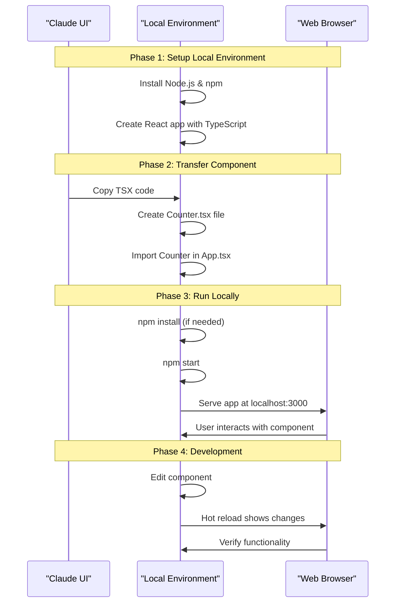

# Step-by-Step: Taking a Claude-Generated TSX Component to Local Development



# Practical Example

```bash
# 1. Create a new React TypeScript project
npx create-react-app counter-app --template typescript

# 2. Navigate to the project directory
cd counter-app

# 3. Install Tailwind CSS (optional, but useful for our example)
npm install -D tailwindcss postcss autoprefixer
npx tailwindcss init -p

# 4. Configure Tailwind (create tailwind.config.js)
# Content should look like:
# /** @type {import('tailwindcss').Config} */
# module.exports = {
#   content: ["./src/**/*.{js,jsx,ts,tsx}"],
#   theme: { extend: {} },
#   plugins: [],
# }

# 5. Add Tailwind directives to CSS (in src/index.css)
# Add these lines:
# @tailwind base;
# @tailwind components;
# @tailwind utilities;

# 6. Create a new file for our Counter component
touch src/Counter.tsx

# 7. Copy the Counter component code into Counter.tsx
# (The code from the Counter artifact above)

# 8. Modify src/App.tsx to use our Counter component
# Replace the content with:
# import React from 'react';
# import Counter from './Counter';
#
# function App() {
#   return (
#     <div className="App">
#       <header className="App-header">
#         <Counter />
#       </header>
#     </div>
#   );
# }
#
# export default App;

# 9. Start the development server
npm start

# Your browser should open to http://localhost:3000 with the Counter component

```
