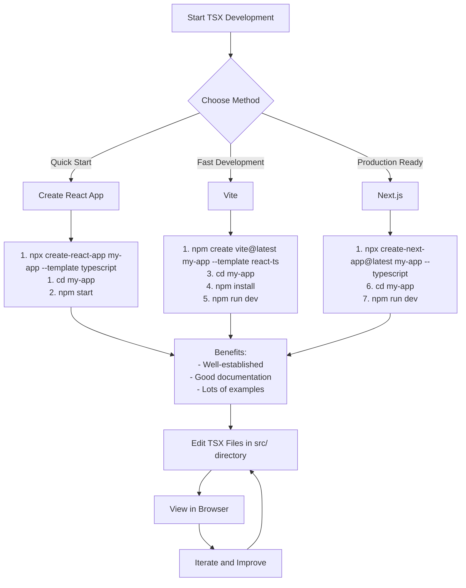

# Setting Up a Local React TSX Development Environment

## Prerequisites

- [Node.js](https://nodejs.org/) (v14 or higher)
- npm (comes with Node.js) or [yarn](https://yarnpkg.com/)

## Method 1: Using Create React App (Quickest)

1. **Create a new React TypeScript project**

   ```bash
   npx create-react-app my-tsx-app --template typescript
   ```

2. **Navigate to your project folder**

   ```bash
   cd my-tsx-app
   ```

3. **Start the development server**

   ```bash
   npm start
   ```

   Your browser should automatically open to `http://localhost:3000`

4. **Edit TSX files**
   - Main component files are in the `src` folder
   - Edit `src/App.tsx` to modify the main application
   - Create new components in the `src` folder

## Method 2: Using Vite (Faster Development Experience)

1. **Create a new Vite project with React and TypeScript**

   ```bash
   npm create vite@latest my-vite-app -- --template react-ts
   ```

2. **Navigate to your project folder**

   ```bash
   cd my-vite-app
   ```

3. **Install dependencies**

   ```bash
   npm install
   ```

4. **Start the development server**

   ```bash
   npm run dev
   ```

   Your app will be available at `http://localhost:5173`

## Method 3: Using Next.js (Full-Featured Framework)

1. **Create a new Next.js project**

   ```bash
   npx create-next-app@latest my-next-app --typescript
   ```

2. **Navigate to your project folder**

   ```bash
   cd my-next-app
   ```

3. **Start the development server**

   ```bash
   npm run dev
   ```

   Your app will be available at `http://localhost:3000`

## Working with an Existing TSX File

If you have a standalone TSX file and want to run it:

1. **Create a basic React TypeScript project using one of the methods above**

2. **Copy your TSX file into the src directory** (for example, as `src/MyComponent.tsx`)

3. **Import and use your component in App.tsx**

   ```tsx
   import MyComponent from './MyComponent';

   function App() {
     return (
       <div className="App">
         <MyComponent />
       </div>
     );
   }

   export default App;
   ```

4. **Run the development server** using the appropriate command for your setup


