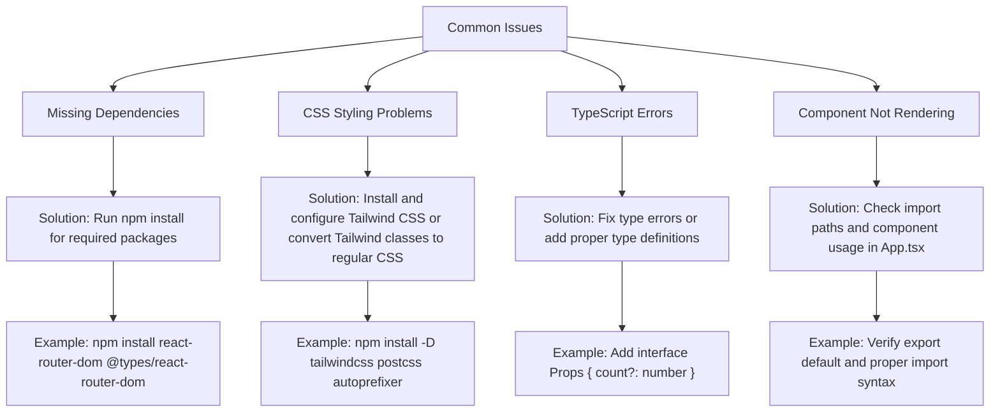

# Troubleshooting Common Issues

```mermaid
graph TD
    A["Common Issues"] --> B["Missing Dependencies"]
    A --> C["CSS Styling Problems"]
    A --> D["TypeScript Errors"]
    A --> E["Component Not Rendering"]

    B --> B1["Solution: Run npm install for required packages"]
    C --> C1["Solution: Install and configure Tailwind CSS or convert Tailwind classes to regular CSS"]
    D --> D1["Solution: Fix type errors or add proper type definitions"]
    E --> E1["Solution: Check import paths and component usage in App.tsx"]

    B1 --> F["Example: npm install react-router-dom @types/react-router-dom"]
    C1 --> G["Example: npm install -D tailwindcss postcss autoprefixer"]
    D1 --> H["Example: Add interface Props { count?: number }"]
    E1 --> I["Example: Verify export default and proper import syntax"]
```
