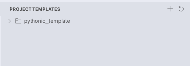

# Project Template Manager

## Overview

Project Template Manager streamlines your workflow by providing a structured way to create new projects and add template components to existing ones. Save time and ensure consistency by reusing your preferred project structures, configurations, and boilerplate code.

## Features

- **Dedicated Template Explorer** - Access all your templates from the VS Code sidebar
- **Create Projects From Templates** - Generate entire project structures with a few clicks
- **Add Template Components** - Selectively incorporate template files/folders into existing projects
- **Template Management** - Easily add, remove, and organize your templates
- **Professional Organization** - Maintain consistent project structures across your work

## Getting Started

### Installation

1. Open VS Code
2. Go to Extensions (Ctrl+Shift+X or Cmd+Shift+X)
3. Search for "Project Template Manager"
4. Click Install

### Using the Template Explorer

The Template Explorer provides quick access to all your templates and template management functions:

1. Click the Project Templates icon in the Activity Bar to open the Template Explorer
2. View available templates in the explorer panel
3. Use the "+" button to add new templates
4. Right-click on templates for available actions

### Creating a New Project

1. Right-click on a template in the Template Explorer and select "Create Full Project from Template"
   - *Alternatively:* Use the Command Palette (Ctrl+Shift+P / Cmd+Shift+P) and type "Create Full Project from Template"
2. Select a destination folder
3. Enter a name for your new project
4. Your new project will be created with all files and structure from the template

### Adding Template Items to Existing Projects

1. Open the folder/workspace where you want to add template items
2. Right-click on a template in the Template Explorer and select "Add Files/Folders from Template"
   - *Alternatively:* Use the Command Palette and type "Add Files/Folders from Template"
3. Select which files or folders from the template to add
4. The selected items will be copied to your current workspace

### Managing Your Templates

#### Adding a Template
1. Click the "+" button in the Template Explorer title bar
2. Select a folder to use as a template
3. Enter a name for the template

#### Copying Template Files/Folders
1. Expand a template to see its contents
2. Right-click on any file or folder
3. Select "Copy to Workspace" to add it to your current project

#### Deleting a Template
1. Right-click on a template in the Template Explorer
2. Select "Delete Template"
3. Confirm the deletion

## Included Template

The extension comes with a default "pythonic_template" that demonstrates a well-structured Python project with:

- Standardized project layout
- Configuration management
- Data processing utilities
- Documentation structure
- Test framework setup

This template serves as both a useful starting point for Python projects and an example of how to structure your own templates.

## Requirements

- Visual Studio Code 1.96.0 or higher

## Roadmap

Future releases plan to include:

- Template categories for better organization
- Template variables for dynamic content
- Template synchronization across devices
- Additional template examples for various technologies

## License

This project is licensed under the Creative Commons Attribution-NonCommercial 4.0 International License (CC BY-NC 4.0).

See the [LICENSE](LICENSE) file for details.

## Support

If you encounter any issues or have suggestions for improvements, please [create an issue](https://github.com/artinmajdi/Project-Template-Manager/issues) on our GitHub repository.

---

**Enjoy streamlining your development workflow with Project Template Manager!**
